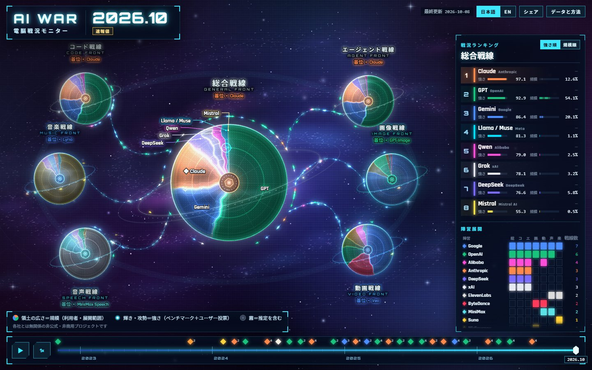
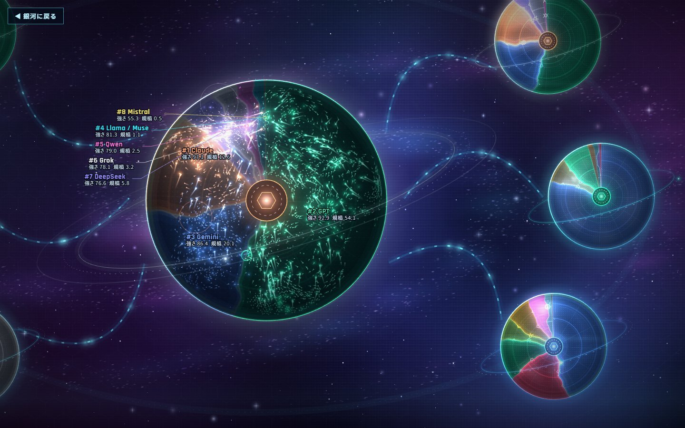
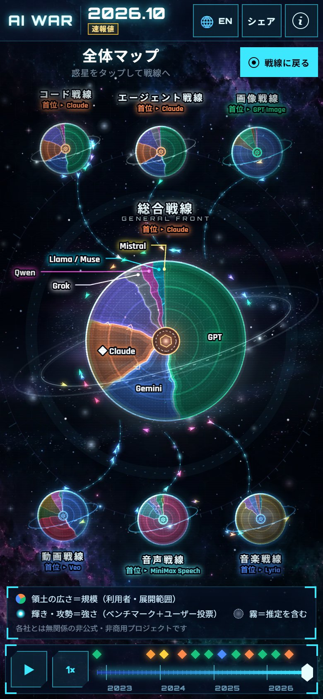

# AI WAR（電脳戦況モニター）

> 非公式・非商用のプロジェクトです。各 AI 企業とは関係ありません。

**サイト：<https://ukitako1030.github.io/EVAL/>** · [English](README.en.md)



| 惑星にズームした戦闘 | スマホ |
| --- | --- |
|  |  |

## 1. AI WAR とは

日々生まれ、更新される AI（ChatGPT のような文章 AI、画像・動画・音声・音楽の生成 AI、パソコンを操作するエージェント）の**いまの立ち位置**を、公開されている客観的なデータをもとに「戦況」として眺められるサイトです。

- 企業を「**軍**」、製品ファミリー（GPT、Claude、Gemini など）を「**部隊**」、分野を「**戦線（惑星）**」として描きます。
- 戦線は 7 つ：総合・コード・エージェント・画像・動画・音声・音楽。
- 2022 年 11 月（ChatGPT 公開＝開戦）から現在までを、月ごとにタイムラインで再生できます。
- 見る人は操作せず「観戦」します。収益化はしません。

サイトは「`site/`」、データを集めて計算する部分は「`pipeline/`」にあります。サイトが読むデータは `site/public/data/world.json` の 1 ファイルだけで、外部サイトには一切アクセスしません。

## 2. データのしくみ

各部隊の状態は、3 つの数字で表します。

| 名前 | 意味 | 画面での見え方 |
|---|---|---|
| **強さ**（0〜100） | その月の首位を 100 としたとき、どれだけ迫っているか。ベンチマークや対戦型ランキング（Arena など）の点数を、首位との差に直して合算します | 光の強さ・攻勢 |
| **規模**（戦線内のシェア %） | その戦線の中での利用の大きさ。戦線ごとに合計 100% になります。公式発表の利用者数、Web アクセス順位、OpenRouter の利用量、Wikipedia の閲覧数などから計算します | 惑星の中の領土の広さ |
| **確度**（高・中・再構成・推定） | その数字がどれだけ確かか。データが少ない・逆算した・推定した部隊ほど | 戦場の「霧」の濃さ |

計算方法・使っているデータ源・既知の偏りと限界は、サイトの **「データと方法」ページ**（`methods.html`、日本語と英語）にまとめています。文章は `site/src/ui/methodsText.ts` にあります。

もっと詳しく知りたいときは、次の文書を読んでください。

- 設計書：[`docs/superpowers/specs/2026-10-08-ai-war-design.md`](docs/superpowers/specs/2026-10-08-ai-war-design.md)（目的、用語、計算方法、運用）
- 最初に本物のデータで動かした記録：[`docs/superpowers/recon/first-run.md`](docs/superpowers/recon/first-run.md)
- 数字の一覧と推移グラフ：[`mockups/shots/data-report-2026-10.jpg`](mockups/shots/data-report-2026-10.jpg)（最新版は `npm run report` で作れます）

### どのファイルが何をしているか

| 場所 | 中身 | 手で直すことがあるか |
|---|---|---|
| `pipeline/raw/` | 取得したデータの保存場所（日付つき）。計算をやり直せるように全部残します | ありません（自動で増えます） |
| `pipeline/curated/units.yaml` | 軍・部隊の一覧と、どのモデルをどの部隊とみなすか | 新しい部隊を足すとき |
| `pipeline/curated/announcements.yaml` | 公式に発表された利用者数（出典 URL つき） | 月 1 回ほど、新しい発表を足すとき |
| `pipeline/curated/events.yaml` | 戦況速報（「○○ 参戦」などの文）の手直しと追加 | 文を直したいとき |
| `pipeline/curated/credits.yaml` | データ源以外のクレジット | ほぼありません |
| `pipeline/config/method.yaml` | 計算の重みなどの設定 | 計算方法を変えるとき（変更は記録に残します） |
| `site/public/data/world.json` | サイトが読む唯一のデータ。自動で作られます | 直接は直しません |

## 3. 毎週の流れ

**毎週月曜 朝 9:00（日本時間）に、自動で「今週の戦況更新」というプルリクエスト（PR）が届きます。** 中身を見て「承認（マージ）」すると、サイトに反映されます。承認しない限り、サイトは変わりません。

1. **自動：** GitHub Actions（`weekly-update`）がデータを取得 → 計算 → テスト → サイトのビルド確認 → 変更をまとめた PR を作ります。同じ PR を毎週更新する形なので、PR が何本も溜まることはありません。
2. **あなた：** GitHub の「Pull requests」タブで「今週の戦況更新（日付）」を開き、本文の要約を読みます（数分）。
3. **あなた：** 問題なければ **「Merge pull request」→「Confirm merge」**。数分後にサイトが更新されます（「Actions」タブの `deploy` が緑になれば完了）。
4. マージしない週があっても、サイトは最後に承認したデータで正常に動きます。

PR の下に「ci … Approve and run」や「承認待ち」と出ることがありますが、**無視して大丈夫**です。同じテストは PR を作る前に `weekly-update` の中で通っています（自動で作られた PR では、GitHub が念のため実行の承認を求めるためです）。

### PR の要約の読み方

| 見出し | 見るポイント |
|---|---|
| 首位 | 戦線ごとの「強さ」「規模」の首位。**⚠ がついていたら首位が交代**しています（前の首位 → 新しい首位） |
| 大きな変動 | 強さが 3 以上、または規模が 2 以上動いた部隊。**太字**がその基準を超えた数字です。急に大きく動いていたら、本当かどうか確認してください |
| 新しい戦況速報 | 先週はなかった速報。★ は重大な速報です |
| 新部隊 | 新しく参戦した部隊 |
| データ源 | 取得に**失敗**したデータ源と、キーがなく**スキップ**したデータ源。折りたたみの表で、全データ源の「データの最新日」が見られます |
| 警告 | 計算中に気になった点（データ不足など） |

### 何かおかしいとき

| 状況 | 対応 |
|---|---|
| 数字や順位がおかしい | その PR にコメントするか、**Claude に PR の URL と気になる点を伝えてください**。原因を調べて、必要なら `pipeline/curated/*.yaml` を直します。PR のブランチ（`data/weekly-update`）は毎週作り直されるので、そこへ直接ファイルを直しても次の月曜に消えます。直すときは `main` に反映します |
| 一部のデータ源が「失敗」 | そのデータ源は前回までのデータをそのまま使っています。1〜2 週なら放置して大丈夫です。何週も続くときは、データ源の形式が変わった可能性があるので Claude に相談してください |
| 「スキップ」と出る | API キーが未設定のデータ源です（「4. API キー」参照）。`static source` と書かれたものは、もともと手動で取り込む固定データなので正常です |
| 月曜になっても PR が来ない | 「Actions」タブ → `weekly-update` を開いて、失敗していないか確認します。**すべてのデータ源が失敗した週（ネットワーク障害など）は、PR を作らずに失敗で止まります**（GitHub からメールが届きます）。直後に「Run workflow」ボタンで手動実行できます |
| 何週もマージしていない | 公開リポジトリは、60 日間まったく動きがないと自動実行が止まることがあります。止まったら「Actions」タブ → `weekly-update` → **Enable workflow** を押してください |
| 今すぐ更新したい | 「Actions」タブ → `weekly-update` → **Run workflow** |

## 4. API キーを GitHub Secrets に登録する

一部のデータ源は、無料のキー（トークン）が必要です。**キーはなくても動きます**（そのデータ源が「スキップ」になるだけです）が、あると計算の土台が厚くなります。

> **キーの扱い（大事）**
> - キーは **GitHub Secrets** か、手元の **`.env` ファイル**（Git の管理外にしてあります）にだけ書いてください。
> - チャット、コード、Issue、PR、スクリーンショットには貼らないでください。
> - 漏れたかもしれないときは、発行元でキーを削除して作り直してください。

| Secret の名前 | 何のデータか | 取得先 | なくても動く？ |
|---|---|---|---|
| `OPENROUTER_API_KEY` | OpenRouter の利用量（規模の一部） | [openrouter.ai/settings/keys](https://openrouter.ai/settings/keys) で作成 | 動く。ただしキーなしだと直近 30 日分しか取れず、履歴が 2026-08 からになる |
| `CLOUDFLARE_API_TOKEN` | Cloudflare Radar の生成 AI サービスランキング（規模の一部） | Cloudflare ダッシュボード → My Profile → API Tokens → Create Token → Create Custom Token。権限は **Account › Radar › Read** | 動く（スキップ） |
| `DESIGNARENA_API_KEY` | Design Arena（画像・動画・音声・音楽の強さの補助） | [designarena.ai/developers/apply](https://designarena.ai/developers/apply) で無料申請 | 動く（スキップ） |

### GitHub への登録手順

1. GitHub でこのリポジトリを開く。
2. **Settings** → 左のメニューの **Secrets and variables** → **Actions**。
3. **New repository secret** を押す。
4. **Name** に上の表の名前（例：`OPENROUTER_API_KEY`）を一字一句そのまま入れ、**Secret** にキーを貼り付けて **Add secret**。
5. 残りのキーも同じ手順で。登録後はキーの値は画面に表示されません（上書きはできます）。

手元で動かすときは、リポジトリ直下に `.env` というファイルを作り、次のように書きます（`ここにキー` の部分を自分のキーに置き換えます）。`.env` は Git にコミットされません。

```
OPENROUTER_API_KEY=ここにキー
CLOUDFLARE_API_TOKEN=ここにキー
DESIGNARENA_API_KEY=ここにキー
```

### 公開まわりの設定（済み）

リポジトリは公開（Public）で、次の 2 つは設定済みです。別のリポジトリに移すときだけ、同じ設定をやり直してください。

1. **Settings → Pages → Build and deployment → Source** が **GitHub Actions**（サイトの公開に必要）。
2. **Settings → Actions → General → Workflow permissions** の **Allow GitHub Actions to create and approve pull requests** にチェック（毎週の PR の自動作成に必要）。

サイトの URL は <https://ukitako1030.github.io/EVAL/> です。

## 5. 手元で動かす

[Node.js](https://nodejs.org/) 24 が必要です。コマンドはターミナルで実行します。

### データ側（`pipeline/`）

```
cd pipeline
npm ci               # 初回だけ。必要な部品を入れる
npm run fetch        # データ源から最新データを取得（pipeline/raw/ に保存）
npm run compute      # world.json を作り直す（サイトが読むデータ）
npm run report       # データ確認レポート（pipeline/out/report.html）を作る
npm test             # テスト
```

- `npm run fetch -- --backfill`：過去分もすべて取得（初回や、新しいデータ源を足したあと）。
- `npm run fetch -- arena-text`：指定したデータ源だけを取得。
- 取得した日付は `pipeline/raw/_status/` に記録されます。`compute` は最新の記録の日付を「いま」として計算するので、同じデータからは同じ結果になります。
- 実行すると `pipeline/out/` に `warnings.json`（計算の警告）と `status-latest.json`（取得結果）ができます。PR の要約はこれらから作られます。`npm run summary -- --before none --after ../site/public/data/world.json --status out/status-latest.json --warnings out/warnings.json` で、PR の本文を手元で確かめられます。

### サイト側（`site/`）

```
cd site
npm ci               # 初回だけ
npm run dev          # 手元でサイトを表示（http://localhost:5173/）
npm test             # テスト
npm run build        # 公開用にビルド（site/dist/ ができます）
```

## 6. 画像（アート）を差し替える

画像がなくても、サイトはプログラムで描いた見た目で動きます。画像を入れると質感が上がります。

- 作ってほしい画像の一覧と生成用の文章（プロンプト）は [`docs/art-requests.md`](docs/art-requests.md) にあります。
- 生成した画像は、リポジトリ直下の **`art-inbox/`** フォルダ（なければ作ってください）に、一覧のファイル名で入れてください。切り抜き・圧縮・着色の調整は Claude が行って組み込みます。
- いま画面が自動で使うのは**背景の星雲だけ**です。`site/public/art/` に `bg-desktop.webp`（または `.jpg` / `.png`、PC 用）と `bg-mobile.webp`（スマホ用）を置くと、次のビルドから使われます。置かなければ、プログラムで描いた背景のままです。
- 惑星の表面・軍の記章・シェア用画像は、これから画面に組み込む予定です（Claude に依頼してください）。
- 文字や企業ロゴ（に似たもの）が写った画像は使えません。

## 7. クレジットとライセンス

- このプロジェクトは**非営利**です。広告や課金などの収益化はしません。
- 使っているデータ源には、CC BY、CC BY-SA、**CC BY-NC（非営利のみ）** など、それぞれ別のライセンスがあります。たとえば SWE-bench と Cloudflare Radar は CC BY-NC なので、**このデータを使ったサイトを営利目的に使うことはできません**。
- 各データ源の名前・ライセンス・クレジットは、サイトの「データと方法」ページと [`pipeline/raw/LICENSES.md`](pipeline/raw/LICENSES.md)（`npm run fetch` が自動で作る一覧）にあります。`world.json` にも `dataLicense` として同じ方針が書かれています。
- `pipeline/raw/` に保存しているのは、各データ源から必要な項目（モデル名・日付・点数・件数）だけを取り出したものです。元のファイルのコピーではありません。
- 企業のロゴは使わず、名前と色で表現しています。
- **プログラム（コード）は MIT ライセンス**です（[`LICENSE`](LICENSE)）。
- MIT の対象は**コードだけ**です。データ（`pipeline/raw/` と `site/public/data/world.json`、`pipeline/curated/` の出典付きの数字）は、上の各データ源のライセンスと条件に従います。MIT で再ライセンスされるものではありません。

## 8. 免責

AI WAR は個人による**非公式**のプロジェクトで、取り上げている企業・製品・サービスの運営元とは関係がありません。社名・製品名は各社の商標です。数字は公開データをもとにした計算結果で、データが少ない部隊には推定が含まれます（確度と霧で示しています）。公式な評価や順位ではありません。
